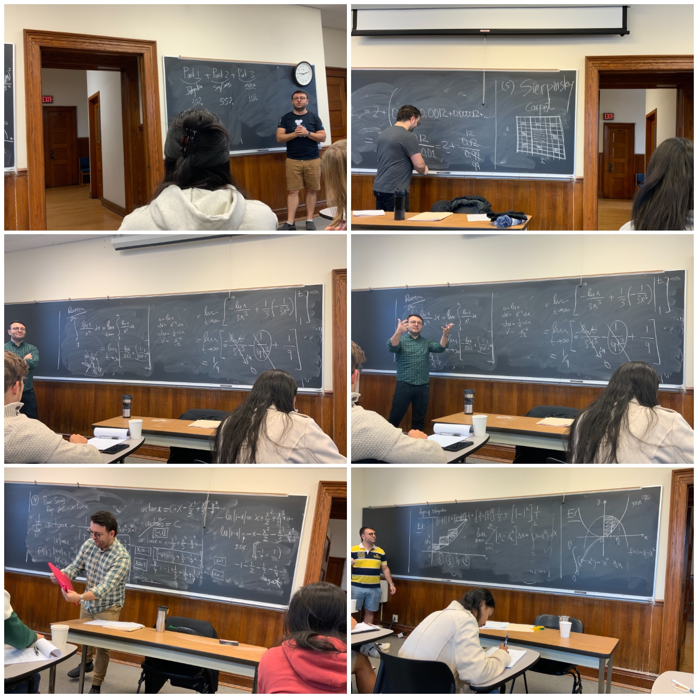

-   👋 Hi, I’m Tural Sadigov, Visiting Assistant Professor of
    Mathematics and Statistics at Hamilton College.

-   👀 I’m interested in Statistics, Machine Learning and Data
    Science.

-   🌱 I’m currently teaching various topics in Statistics, Data Science
    and Machine Learning, and doing research in the combination of
    Applied Mathematics and Machine Learning.

